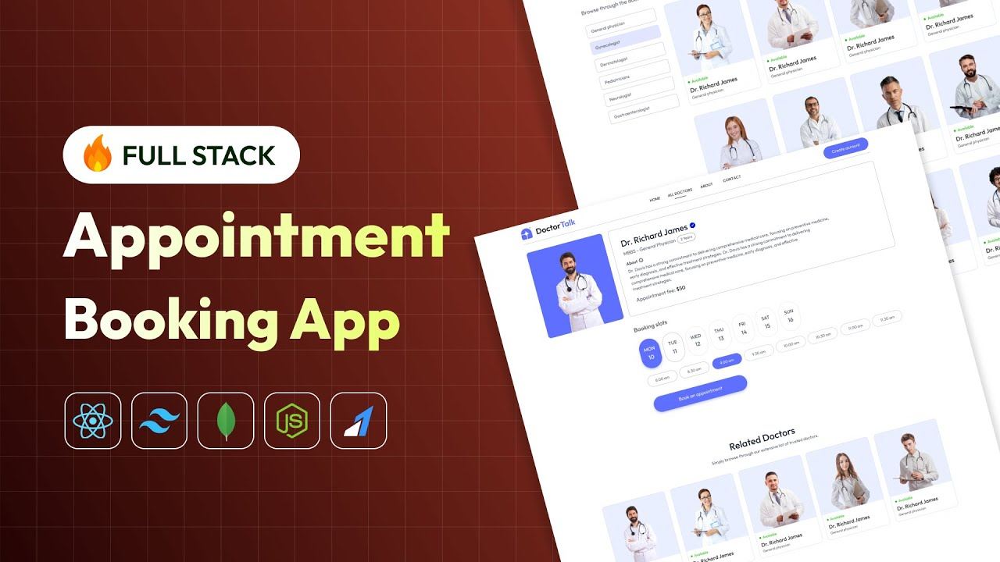

# 🛒 Full-Stack Doctor Appointment App (MERN + Stripe)

A full-featured, responsive Doctor Appointment web app built with the MERN stack. This project includes a customer-facing frontend, an admin dashboard for managing products/orders, and secure Stripe payment integration.

🚀 **Live Demo**

- 🛍️ Customer Frontend: [https://prescripto-frontend-snowy.vercel.app](https://prescripto-frontend-snowy.vercel.app)
- 🛠️ Admin Dashboard: [https://prescripto-admin-kappa-lovat.vercel.app](https://prescripto-admin-kappa-lovat.vercel.app)

---



## 🔐 Admin Access

Use the following credentials to log in as an admin:

- **Email**: `admin@prescripto.com`
- **Password**: `admin@123`

---

## 📚 Features

### 👨‍⚕️ Patient Features

- Patient registration & login
- Browse doctors & filter by specialization
- Book appointments
- Pay securely via Stripe
- View appointment history

### 🛠️ Admin/Doctor Features

- Secure admin login
- Dashboard with appointment statistics
- Manage doctor profiles
- Approve/reject appointments
- Update appointment statuses

---

## 🧰 Tech Stack

### Frontend

- React.js
- Tailwind CSS
- React Router
- Axios

### Backend

- Node.js
- Express.js
- MongoDB & Mongoose
- JWT Authentication
- bcrypt
- cloudinary
- Stripe API (for secure payment)

---

## 💳 Payment Integration

- **Stripe** is used for handling payment processing.
- Customers can enter their card details securely via the Stripe Checkout interface.
- Test Card: `4242 4242 4242 4242` with any future expiration and CVC

---

---

## ⚙️ Installation & Setup

### 1. Clone the Repository

```bash
git clone https://github.com/hilla10/prescripto_mern_app.git
cd prescripto_mern_app

```

### 2. Backend Setup

```
cd backend
npm install
npm run dev

PORT=3000
MONGO_URI=your_mongodb_connection
JWT_SECRET=your_jwt_secret
STRIPE_SECRET_KEY=your_stripe_secret_key
CLOUDINARY_NAME = your_cloudinary_name
CLOUDINARY_API_KEY = your_cloudinary_api_key
CLOUDINARY_SECRET_KEY= your_cloudinary_secret_key

```

### 3. Client Setup (User Frontend)

```
cd ../frontend
npm install
npm run dev

```

### 4. Admin Setup

```
cd ../admin
npm install
npm run dev

```

🧠 What I Learned

- Building and deploying a full-stack app using the MERN stack

- Working with third-party APIs like Stripe

- Implementing authentication and route protection

- Admin dashboard design and role-based access

- Deploying frontend apps to Vercel and backend with cloud database

📌 Disclaimer

- This project is created for educational and portfolio purposes. All product data and images are placeholders. Stripe is used in test mode.

👨‍💻 Author
Hailemichael Negusse
GitHub: [hilla10](https://github.com/hilla10)

This project is open-source and available under the [MIT License](./License)
